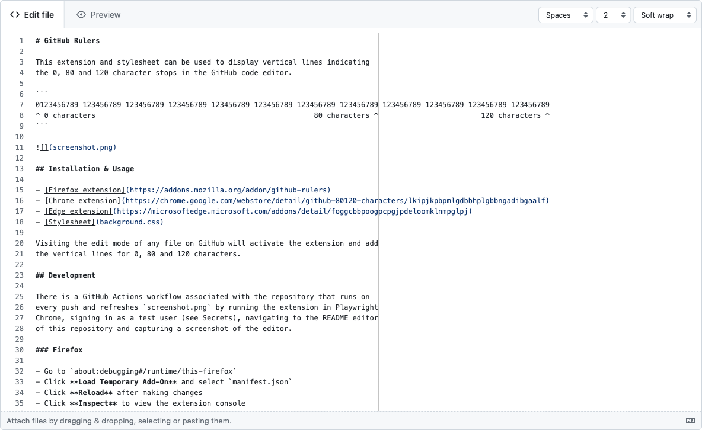

# GitHub Rulers

This extension and stylesheet can be used to display vertical lines indicating
the 0, 80 and 120 character stops in the GitHub code editor.

```
0123456789 123456789 123456789 123456789 123456789 123456789 123456789 123456789 123456789 123456789 123456789 123456789
^ 0 characters                                                   80 characters ^                        120 characters ^
```



## Installation & Usage

- [Firefox extension](https://addons.mozilla.org/addon/github-rulers)
- [Chrome extension](https://chrome.google.com/webstore/detail/github-80120-characters/lkipjkpbpmlgdbbhplgbbngadibgaalf)
- [Edge extension](https://microsoftedge.microsoft.com/addons/detail/foggcbbpoogpcpgjpdeloomklnmpglpj)
- [Stylesheet](background.css)

Visiting the edit mode of any file on GitHub will activate the extension and add
the vertical lines for 0, 80 and 120 characters.

## Development

There is a GitHub Actions workflow associated with the repository that runs on
every push and refreshes `screenshot.png` by running the extension in Playwright
Chrome, signing in as a test user (see Secrets), navigating to the README editor
of this repository and capturing a screenshot of the editor.

### Firefox

- Go to `about:debugging#/runtime/this-firefox`
- Click **Load Temporary Add-On** and select `manifest.json`
- Click **Reload** after making changes
- Click **Inspect** to view the extension console

[Package](#packaging) and deploy to: https://addons.mozilla.org/developers

### Chrome

The Chrome extension is being developed and tested using Puppeteer.

```
npm install
node . $password
```

`$password` is a password to the collaborator `github-80-120@hubelbauer.net`
GitHub account with access to the repository. This is needed so the account can
enter the edit mode of the `readme.md` MarkDown document.

To use Chrome directly and not through Puppeteer:

- Go to chrome://extensions
- Switch **Developer mode** on
- Click **Load unpacked** and select this repository directory
- Click the reload icon after making changes
- Click **Details** > `background page` to view the extension console

[Package](#packaging) and deploy to: https://chrome.google.com/webstore/devconsole

### Edge

Testing is done the same way as for [Chrome](#chrome) using Puppeteer. To test
in Edge proper, I don't have the instructions yet. I might look at adding them
and also at using Playwright for Edge testing in the future.

[Package](#packaging) and deploy to: https://partner.microsoft.com/dashboard/microsoftedge

### Packaging

Prior to publishing the extension, an archive package must be made to upload to
whichever browser extension store is being published to. To generate it, run:

```sh
zip extension.zip manifest.json background.js background.css 48.png 96.png
```

## To-Do

### Generate 800x640 image for the extension stores in GitHub Actions, too

JPG for the Chrome. PNG for the Edge. Note sure about Firefox.

### Set up GitHub Pages with links to the extension stores to use as a repo URL

Set the GitHub Pages site as a repo URL on GitHub. Update the extension home
page link to the GitHub Pages site once done.

### Cut GitHub Releases after each version change with links to the stores

Manually cut a release after each store update and include links to the stores
in the release description.

### Rename the repository and the extensions to GitHub Rulers

Leave the 80 and 120 character keywords in the description for SEO but change
the name.

- [ ] Extension name
- [x] GitHub repository name
- [x] GitHub repository description
- [x] Firefox extension
- [ ] Chrome extension (in review)
- [ ] Edge extension (blocked - needs v3 with `background.service_worker`)
- [ ] GitHub workflow URLs

### Convert to manifest version 2 with `background.service_worker`

Firefox and Chrome still support manifest v2 but the Edge store won't let me
upload it and wants me to use manifest v3.

### Re-upload the Firefox extension and figure out why it was removed

The Firefox extension team removed the extension and would not follow up
during the review so I did not have a chance to prevent this.

Let's initiate another round of reviews and let's hope they are less useless
this time around.

### Drop extension build artifacts in the GitHub Actions artifacts

In case Mozilla or any other browser vendor keep removing the extension I
will have these to fall back on and install the extension from an archive.
